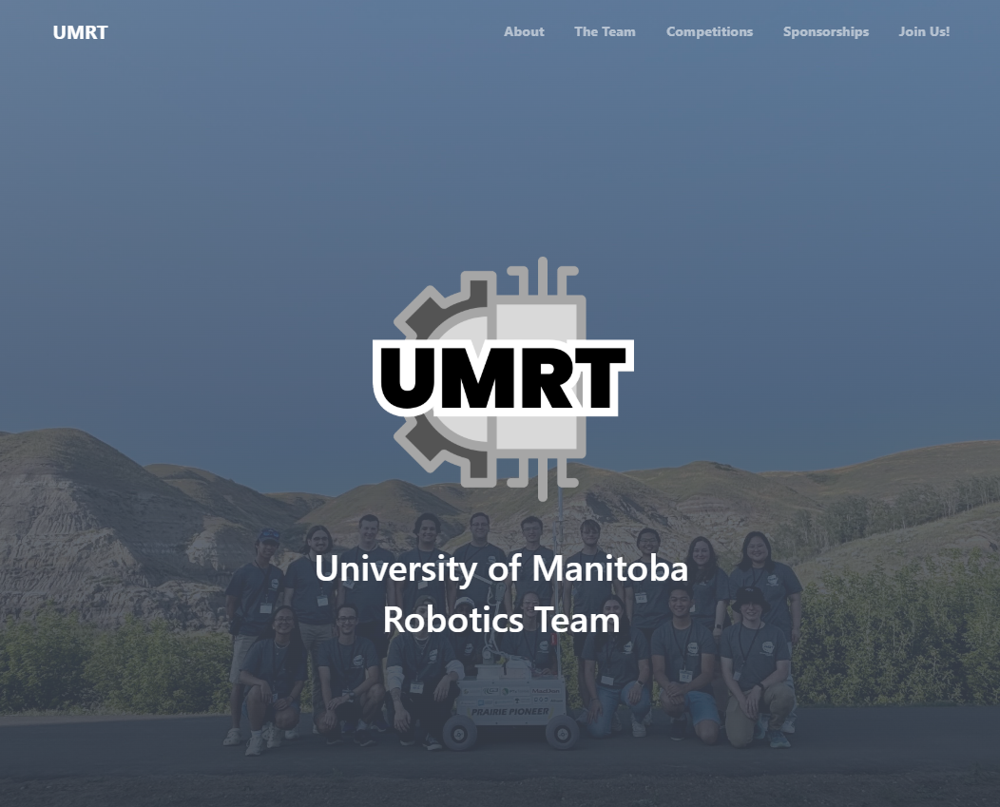

# UMRT Official Website


The official website of the University of Manitoba Robotics Team (UMRT), hosted on GitHub Pages. The site is built using Vue and the Nuxt framework.

Check out our website at [umrt.ca](https://umrt.ca)!

## Updating the Website

To preview changes live, run the following command:

```bash
npm run dev
```

This will host a live preview at http://localhost:4321.


### Updating Team Members
[Connor insert setup steps here].

### Updating Sponsors
[Connor insert setup steps here].

### Updating showcase highlights photos
[Connor insert setup steps here].


## Github Pages Deployment
After pushing your changes to the main branch, the GitHub Actions workflow will automatically:
1. Uploads the output as an artifact
2. Deploys the artifact to GitHub Pages